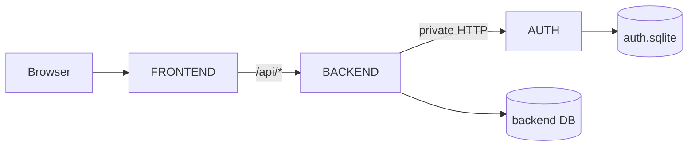
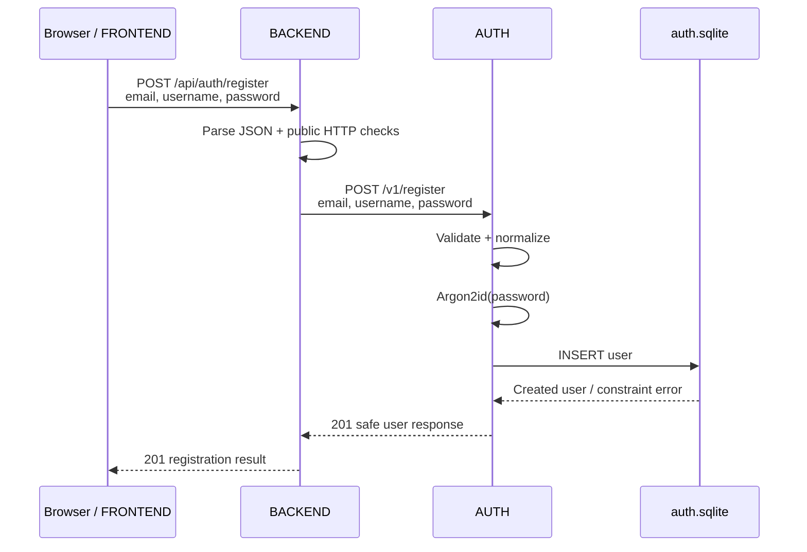
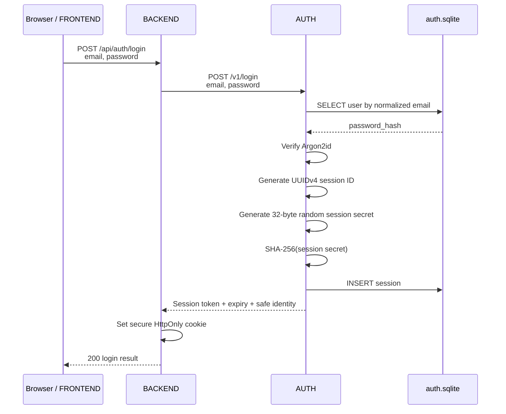
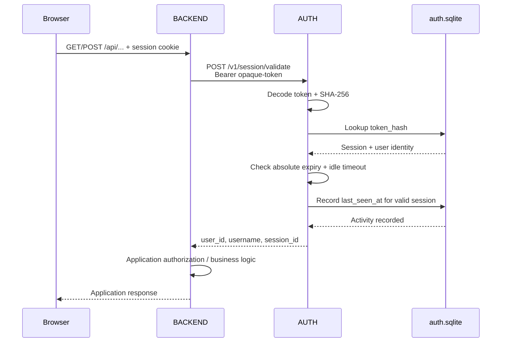
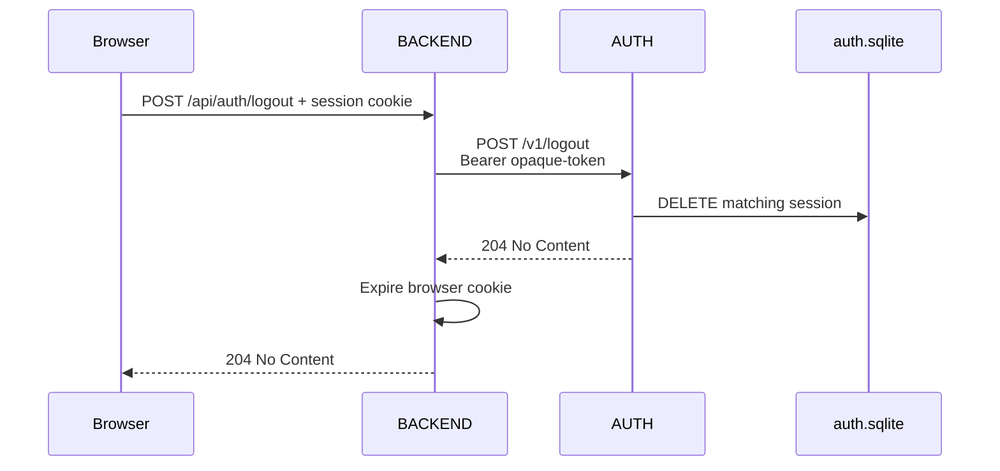

# Architecture

## Topology

AUTH is an internal service. Only BACKEND should be reachable from the browser for application API requests.



The browser never receives AUTH's database representation and never talks directly to `auth.sqlite` or internal AUTH endpoints.

## Trust boundaries

### FRONTEND

FRONTEND is untrusted from AUTH's perspective. Client-side validation exists for user experience only and must never be treated as authoritative.

### BACKEND

BACKEND is the public API / BFF. It:

- parses public HTTP requests;
- rejects malformed or oversized requests;
- applies public rate limits;
- forwards only the minimal typed payload required by AUTH;
- owns browser-facing cookie creation and deletion;
- asks AUTH to validate sessions;
- uses the returned `user_id` for application logic.

AUTH remains authoritative for authentication-specific validation.

BACKEND must **not** query AUTH's SQLite database directly.

### AUTH

AUTH is authoritative for:

- email and username validation rules;
- email normalization;
- password rules;
- password hashing and verification;
- user uniqueness and integrity;
- session creation;
- session validation;
- session expiration;
- session revocation.

AUTH validates requests even if BACKEND has already performed transport-level validation.

## Registration sequence



No session is created during registration in v0.

## Login sequence



## Protected request sequence



## Logout sequence



Logout is idempotent: AUTH returns indistinguishable `204 No Content`
responses for all client-token outcomes. BACKEND clears the cookie regardless
of the result; an internal failure does not guarantee server-side revocation.

## Data ownership

AUTH owns:

```text
users
sessions
password hashes
session token hashes
```

BACKEND owns application data, for example:

```text
profiles
avatar/profile-picture references
posts
comments
application settings
application permissions
```

BACKEND stores AUTH's `user_id` as the stable identity reference wherever application data needs an owner.
